<p align="center">
  <picture>
    <source media="(prefers-color-scheme: dark)" srcset="images/crewloft-logo-dark.svg">
    
  </picture>
</p>

<h3 align="center">혼자 시작해도, 팀과 함께.</h3>
<p align="center">팀은 일하고, 대표는 결정해요.</p>

<p align="center">
  컴퓨터에 익숙하지 않은 1인 · 소수 창업자를 위한 <b>보이는 AI 팀</b> — 3D 사무실에서 일하는 모습을 지켜봐요.<br>
  클라우드에서 24시간 일하고, 휴대폰으로 보고받고 지시해요(준비 중) · 직접 설치하려면 설치를 도와드려요(오픈소스, AGPL-3.0).
</p>

<p align="center">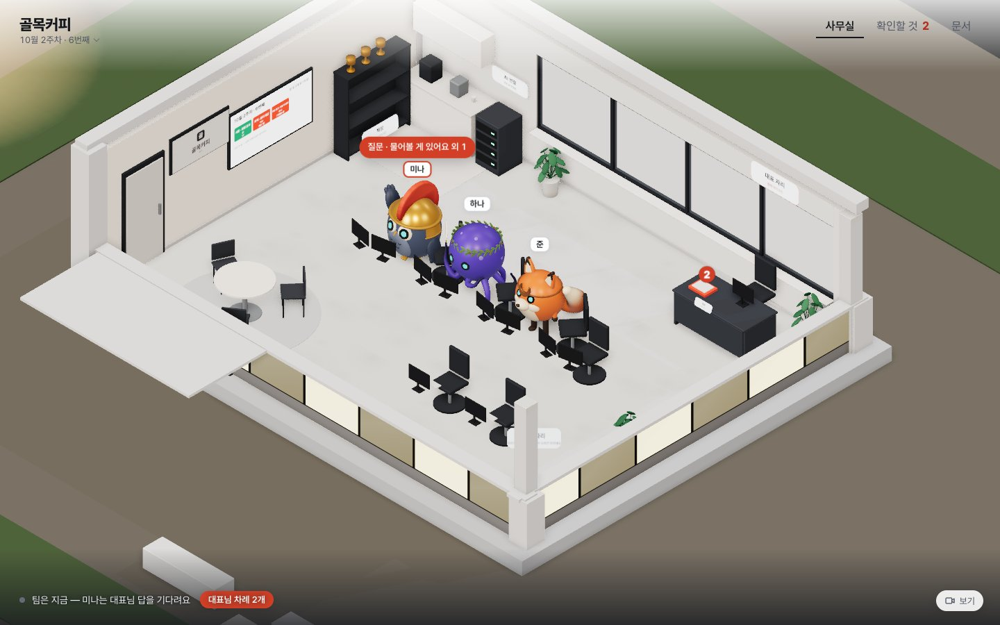</p>

> **개발 중(알파)** — 지금 시험판은 내 컴퓨터에서 돌아가고, 설치 없이 쓰는 온라인판을 준비하고 있어요. 개발은 비공개 저장소에서 하고, 정리된 코드를 이곳에 주기적으로 올려요. 코드 · 명령 속 이름은 아직 옛 가칭 `agent-office`예요(상표 · 도메인을 확보한 뒤 Crewloft로 바꿔요).

---

## 왜 만드나요

> **세상은 아직 불공평합니다. AI를 누구나 사용할 수 있지만 아무나 사용할 수는 없습니다.**

같은 AI를 써도 결과는 쓰는 사람에 따라 하늘과 땅만큼 달라요. 개발자는 AI에게 지식을 쌓아 일을 맡기지만, 컴퓨터에 익숙하지 않은 창업자에게 AI는 여전히 '묻고 답하는 창' 하나예요. 터미널에서 도는 AI 에이전트는 낯설고, 화면을 입힌 도구도 대부분 개발자의 작업 환경에서 나왔어요.

Crewloft는 그 간극을 이어요. 명령어 대신 이름과 얼굴이 있는 AI 직원에게 말로 일을 맡기고, 일하는 모습을 작은 3D 사무실에서 눈으로 보고, 결과는 문서로 받아 결정만 하면 돼요. 팀이 해낸 만큼 사무실이 자라요.

Crewloft는 crew(팀)와 loft(다락방)를 합친 이름이에요. 작은 다락방에서 몇 안 되는 팀원이 같은 목표로 시작해, 함께 자라 가는 회사라는 뜻이에요.

## 어떤 문제를 푸나요

창업 초기에는 할 일이 너무 많은데 함께할 사람이 없어요. 시장 조사, 가격 계산, 인허가 체크리스트, 소개 문구, 첫 고객 모으기까지 — 혼자 다 하거나, 매번 AI 대화창에 묻고 받아 적어야 해요.

- **AI 대화창**은 내가 매번 묻고, 결과를 정리하고, 다음 할 일을 정해야 해요.
- **자동화 도구**는 흐름을 내가 직접 짜야 해요.
- **에이전트 도구**는 대부분 개발자용이고, 무엇을 했는지 · 얼마를 썼는지 · 밖으로 무엇이 나갔는지 보기 어려워요.

## Crewloft는 이렇게 해요

**하려는 사업을 말하면, 매니저 AI가 사업을 이해하고 그에 맞는 팀 · 업무 · 공간을 셋팅해요.** AI 팀이 창업 초기의 일을 나눠 맡고, 대표는 확인 · 결정만 해요. 모든 과정은 회사와 함께 자라는 3D 사무실에서 보여요.

| 대표에게 하는 약속 | 제품에서 지키는 방법 |
| --- | --- |
| **팀이 일한다** | 매니저가 주간 계획을 세우고 업무 블록을 직원에게 나눠요. 직원은 결과물과 인계 메모로 협업해요. |
| **대표는 결정한다** | 대표님 차례(확인할 것)를 위험도 세 가지(사무실 안 · 방향 · 밖으로)로 나눠요. 밖으로 나가는 일은 대표가 원문을 확인하고 승인해야만 나가요. |
| **다 보인다** | 3D 사무실 · 작업 기록 · 사용 한도. 누가 무엇을 했고 얼마를 썼는지 숨기지 않아요. |

## 어떻게 동작하나요

```
① 사업 소개        "동네 직장인을 위한 작은 카페를 열려고 해요…"
      ↓
② 매니저 면접       후보 3명이 내 사업을 읽고 각자 방향 · 첫 달 계획을 제안 → 대표가 고용
      ↓
③ 사업 인터뷰       단계 · 고객 · 막힌 곳 · 이번 달 목표 · 대표가 직접 할 일
      ↓
④ 사업 설계도       이번 달 목표 + 업무 블록(시장 조사 · 가격 · 준비 체크리스트 · 소개 문구 …) + 채용 순서
      ↓
⑤ 매주 회차         매니저가 이번 주 블록을 나눔 → 직원이 결과물 → 결정함에서 대표 확인 → 주간 회고
      ↓
⑥ 성장              실제 결과물 · 피드백이 쌓이면 사무실이 넓어지고 기능이 열림(가짜 게임 숫자 없음)
```

<table>
  <tr>
    <td width="50%">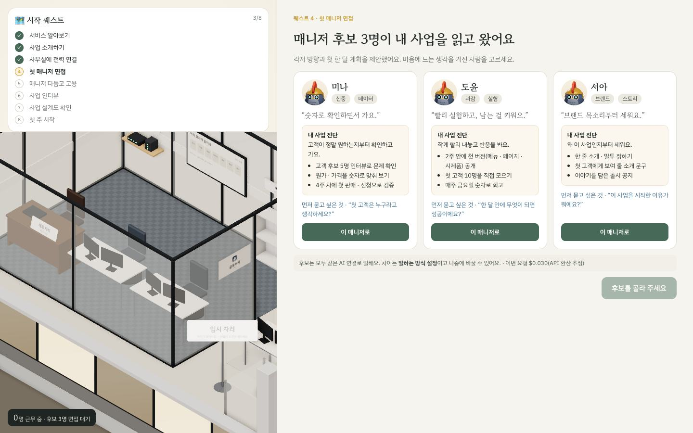<br><sub>② 매니저 후보 3명이 내 사업을 읽고 각자 계획을 제안해요</sub></td>
    <td width="50%">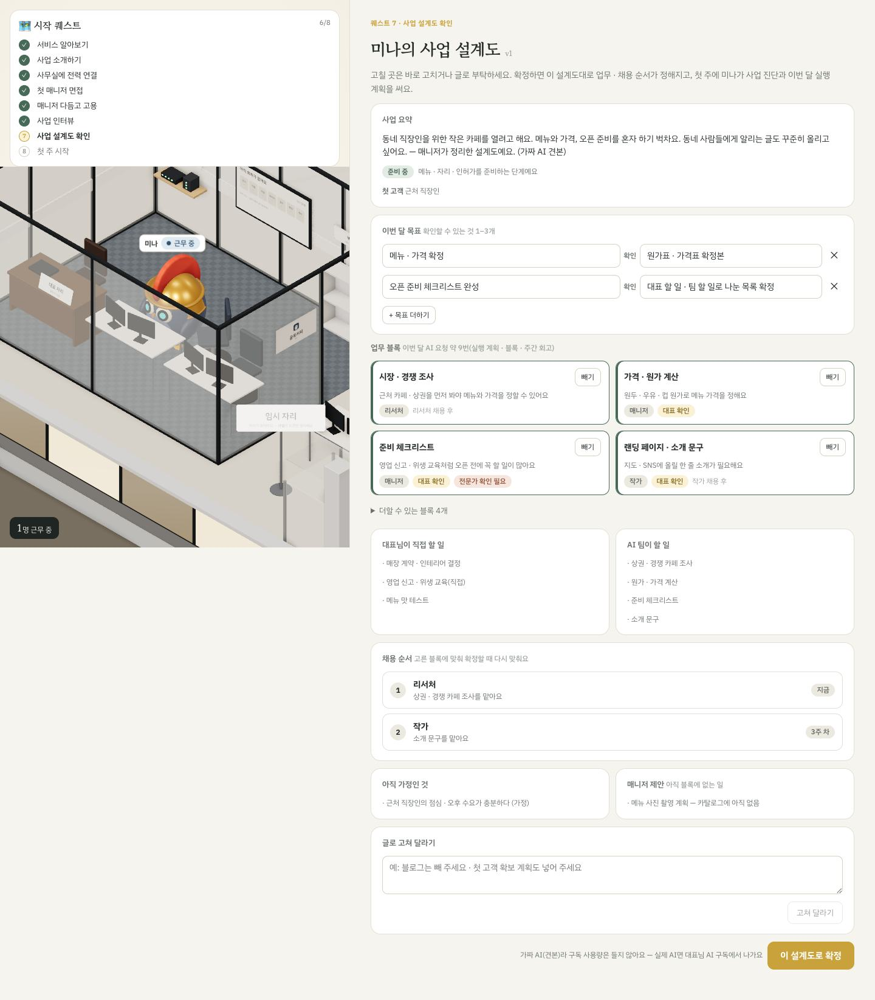<br><sub>④ 사업 설계도 — 목표 · 업무 블록 · 대표 몫과 팀 몫 · 채용 순서</sub></td>
  </tr>
  <tr>
    <td>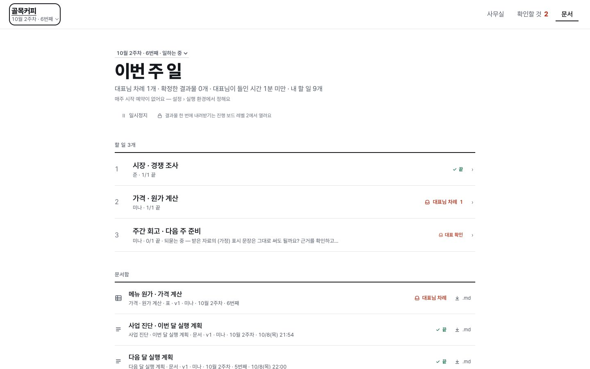<br><sub>⑤ 문서 — 이번 주 일 · 문서함을 한 화면에, 숫자는 문장 한 줄로</sub></td>
    <td>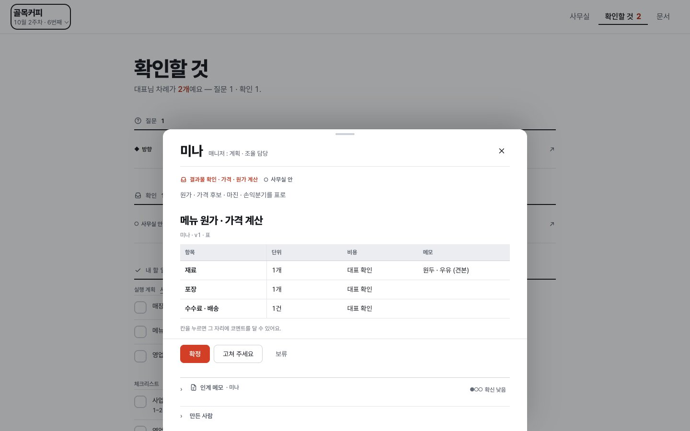<br><sub>확인할 것 — 결과물을 시트에서 보고 확정 · 고쳐 주세요 · 보류, 인계 메모는 접어 둠</sub></td>
  </tr>
  <tr>
    <td>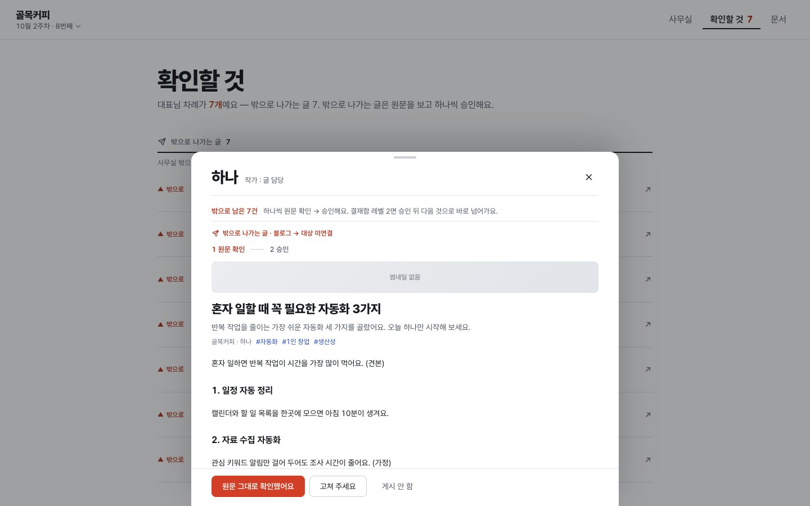<br><sub>밖으로 나가는 글은 ① 원문 확인 → ② 승인, 두 단계를 거쳐요(기본은 연습 게시)</sub></td>
    <td align="center">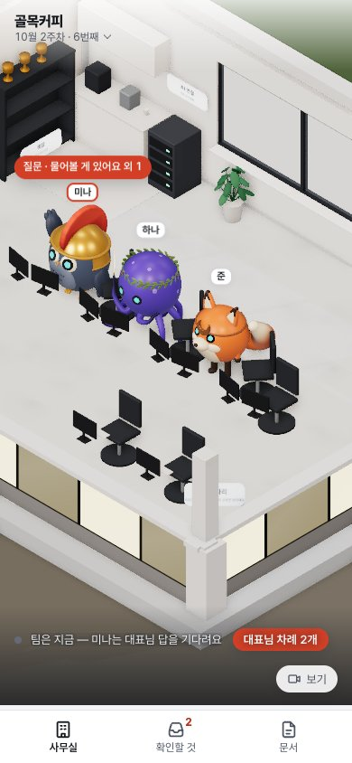<br><sub>휴대폰 — 메뉴 세 칸(사무실 · 확인할 것 · 문서)</sub></td>
  </tr>
</table>

## 화면을 이렇게 바꿨어요 (As-is → To-be)

알파 화면은 기능은 다 있었지만 **한 화면에 개념이 너무 많고**(회차 · 블록 · 등급 · 수치 · 레벨), 같은 일이 여러 번 나오고, 메뉴 다섯 개 아래 탭이 또 있었어요. 모양도 요즘 AI 서비스와 같은 카드 상자 대시보드라 **3D 사무실이 구석 장식**이 됐어요. 컴퓨터에 익숙하지 않은 창업자(결정 84)에게 '쉬운 건 앞에서'(결정 86)라는 원칙과 어긋났죠.

그래서 같은 장면을 네 가지 구조(사무실 전체 · 매니저와 대화 · 오늘 할 일 하나 · 문서처럼)로 눌러 볼 수 있는 견본을 만들어 비교했고, **사무실이 화면 전체인 구조**를 골랐어요(결정 87). 기능은 하나도 빼지 않고 자리만 옮겼어요 — 안전장치 여섯 가지(원문 확인 → 승인, 되묻기, 인계 메모 …)도 그대로예요.

<p align="center">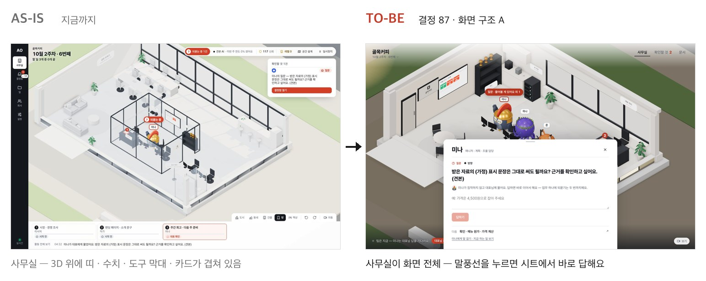</p>
<p align="center">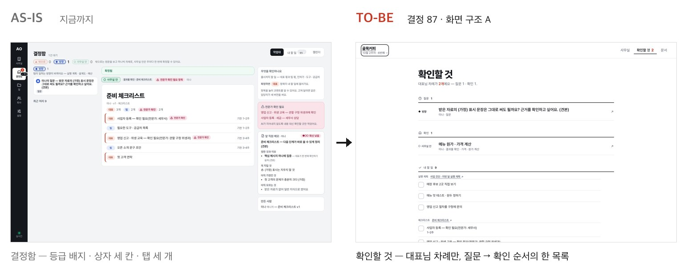</p>
<p align="center">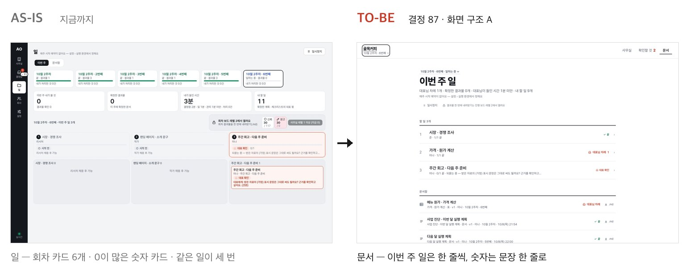</p>
<p align="center">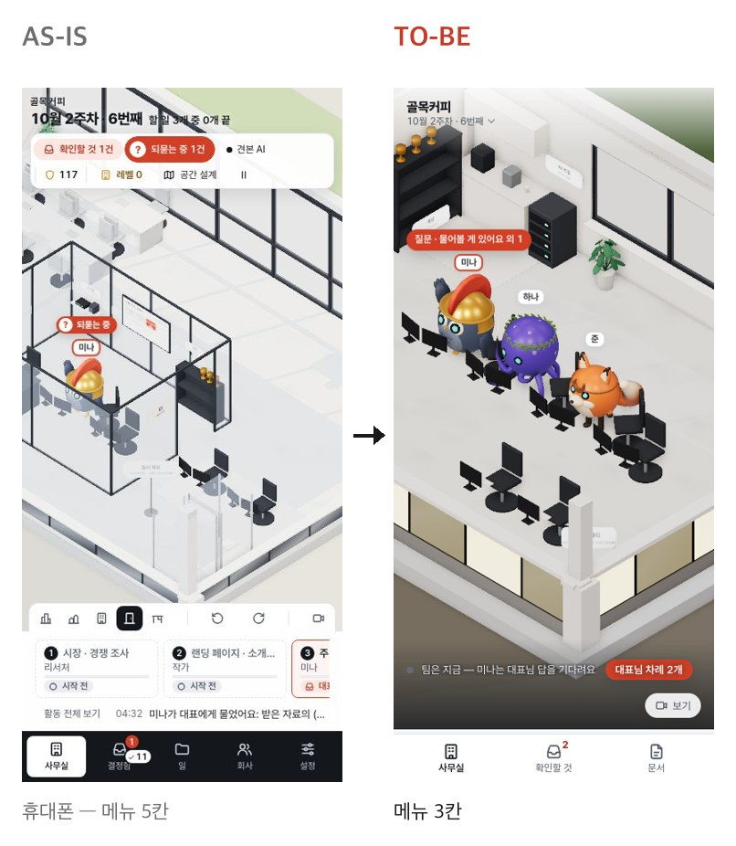</p>

| | As-is | To-be |
| --- | --- | --- |
| 메뉴 | 5개(사무실 · 결정함 · 일 · 회사 · 설정) + 화면마다 탭 3개 | 3개(사무실 · 확인할 것 · 문서), 회사 · 설정은 회사 이름 뒤 |
| 대표가 할 일 찾기 | 결정함으로 이동 → 등급 · 회차별 목록에서 고르기 | 직원 머리 위 말풍선을 누르면 그 자리에서 시트 |
| 같은 일 표시 | 위쪽 카드 · 열 제목 · 안쪽 항목, 세 번 | 한 줄 |
| 숫자 | 숫자 카드 4개(대부분 0) · 신뢰 · 원고 · 레벨 | 문장 한 줄("대표님 차례 1개 · 들인 시간 1분 미만 …") |
| 모양 | 둥근 상자 · 상자 안 상자 · 연한 배지 | 선 · 여백 · 글자 크기, 빨간색은 대표님 차례에만 |

온보딩 · 사업 설계도 화면은 다음 차례에 같은 방식으로 바꿔요.

## AI 팀을 안전하게 운영하는 장치

AI 직원 여럿이 일할 때 생기는 문제(멋대로 밖에 게시, 비용 폭주, 근거 없는 내용, 맥락이 끊김)를 제품 구조로 막아요.

1. **인계 메모** — 직원이 일을 넘길 때 정한 것 · 이유 · 꼭 지킬 것 · 아직 가정인 것 · 모르는 것을 남겨요.
2. **되묻기** — 정보가 모자라면 추측하지 않고 앞 직원이나 대표에게 물어요(업무당 최대 2번).
3. **결정 등급 세 가지** — 사무실 안(한 번에 확정) · 방향(계획 · 예산이 바뀜) · 밖으로(원문 확인 뒤 하나씩 승인).
4. **승인 지문** — 승인한 뒤 내용 · 받는 곳 · 시각이 바뀌면 보내지 않고 다시 물어요.
5. **작업 기록 사슬** — 모든 AI 실행을 앞 기록과 이어진 지문으로 남겨, 고친 기록을 찾아내요.
6. **사용 한도** — 업무 · 직원별 주간 · 사무실 주간 한도. 닿으면 팀이 쉬고 "계속할까요?"를 물어요.

## 기술

| 영역 | 사용 |
| --- | --- |
| 서버 | Node.js 24(TypeScript를 빌드 없이 실행), 내장 SQLite(`node:sqlite`) |
| 화면 | Preact + htm(빌드 없음), three.js 3D 사무실 |
| AI | 공급자 교체형 구조 — Claude Code(내 구독) · 견본 AI(비용 0으로 전체 흐름 확인) · API 키 연결은 준비 중 |
| 운영 | 클라우드에서 24시간 도는 온라인판(설치 없이 웹, 준비 중)이 기본 · 직접 설치(내 컴퓨터 · 서버)도 도와드림 — 직접 설치하면 데이터와 AI 계정은 모두 내 것 |
| 품질 | 자동 테스트 67개, 견본 AI로 온보딩 → 1주차 → 2주차 전 과정 확인 |

## 직접 실행해 보기

Node 24 이상, git, npm이 필요해요. 처음에는 **견본 AI**(돈이 들지 않는 가짜 AI)와 **연습 게시**(밖으로 아무것도 나가지 않음)로 돌아가요.

```bash
git clone https://github.com/axseungpyo/crewloft.git
cd crewloft
npm install
npm run demo    # 견본 AI 데모 사무실 → http://127.0.0.1:4317
```

한 줄 설치도 돼요(설치 폴더 `~/.agent-office`, 명령 `agent-office`).

```bash
curl -fsSL https://raw.githubusercontent.com/axseungpyo/crewloft/main/scripts/install.sh | bash
agent-office doctor   # 실행 환경 점검
agent-office demo     # 견본 AI 데모 사무실
agent-office start    # 내 사무실
```

| 명령 | 하는 일 |
| --- | --- |
| `agent-office start` | 사무실 켜기(`--port` · `--host` · `--data`) |
| `agent-office demo` | 견본 AI 데모 사무실(`data-demo/`) |
| `agent-office doctor` | Node · 의존성 · 데이터 폴더 · 포트 · Claude Code 점검 |
| `agent-office backup` | 사무실 데이터를 파일 하나로 백업(켜져 있어도 안전) |
| `agent-office update` | 최신 코드로 업데이트 |

- **내 Claude 구독으로 쓰기:** Claude Code를 설치하고 터미널에서 `claude`를 한 번 실행해 직접 로그인한 뒤, 온보딩이나 **설정 › AI 연결**에서 Claude Code를 고르세요. 이 앱은 로그인 정보를 읽거나 저장하지 않아요.
- **서버에 올릴 때:** 기본은 이 컴퓨터(127.0.0.1)에서만 열려요. 서버에 올리면 **설정 › 출입 비밀번호**를 켜거나 `AUTH_MODE=accounts`(이메일 가입 · 로그인)로 켜고, HTTPS 뒤에 두세요 — [서버 배포 안내](docs/tech/vps-deployment.md).
- **개발:** `npm run dev`(내 사무실, `data/`) · `npm test`(외부 호출 없는 테스트) · `npm run typecheck`. 설정 예시는 `.env.example`.

## 지금까지 만든 것 (2026년 10월)

- ✅ 사업 맞춤 온보딩(매니저 면접 · 사업 인터뷰 · 사업 설계도)
- ✅ 업무 블록 엔진(시장 조사 · 가격 · 준비 체크리스트 · 소개 문구 · 첫 고객 · 콘텐츠 운영 등)과 주간 회차
- ✅ 결정함 · 문서함 · 대표 할 일 · 주간 회고
- ✅ AI 팀 운영 안전장치 여섯 가지
- ✅ 자라는 3D 사무실, 밝게 · 어둡게 화면, 휴대폰 화면
- ✅ 브랜드(Crewloft · 로고 · 말투)
- ✅ 화면 구조 다시 짜기 — 사무실이 화면 전체, 메뉴 세 개(결정 87)

## 다음 계획

목표는 **사람을 뽑기 전에도 굴러가고, 사람을 뽑을 만큼 자라는 회사**예요.

- **24시간 일하는 사무실** — 클라우드나 내 서버에서 쉬지 않고 돌아, 대표가 잠든 사이에도 팀이 이번 주 계획대로 일해요.
- **휴대폰 하나로 경영** — 휴대폰 웹 화면과 Slack으로 아침 보고를 받고, 승인하고, 새 업무를 지시해요.
- **일할수록 나아지는 팀** — 회사 하나의 맥락 · 지식 위에서 결과물 · 피드백 · 성공 · 실패 기록으로 업무 방식 · 지시문 · 회사 지식이 고쳐지는 자기 개선 순환(RSI를 모델이 아닌 업무 지식에 적용). 회사 전체 규칙을 바꾸는 개선은 대표가 확인해요.
- **사용 시험** — 업종이 다른 초기 창업자 5~10명과 4주 이상(대표가 들인 시간 · 고치지 않고 쓴 비율의 회차별 변화 · 4주 뒤 재방문)
- **설치 도움** — 컴퓨터에 익숙하지 않아도 따라 할 수 있는 설치 안내


## 문서

- 제품 요구사항: [PRD](docs/product/PRD.md) · 결정 기록: [decisions](docs/product/decisions.md)(번호 붙은 결정과 그 이유)
- 브랜드: [Crewloft 브랜드](docs/product/specs/crewloft-brand.md) · 공간 · 성장: [성장형 사무실](docs/product/specs/growth-office.md) · [필요의 방](docs/product/specs/space-generation.md)
- 사용 안내: [user-guide](docs/tech/user-guide.md) · 구조: [architecture](docs/tech/architecture.md)
- 기여: [CONTRIBUTING](CONTRIBUTING.md) · 보안 신고: [SECURITY](SECURITY.md)
- English: [README.en.md](README.en.md)

## 라이선스

[AGPL-3.0-or-later](LICENSE). 자유롭게 쓰고 고치고 나눌 수 있어요. 고친 버전을 네트워크 서비스로 운영하면 그 서비스 사용자에게 고친 소스를 제공해야 해요. 함께 쓰는 외부 구성 요소: [THIRD_PARTY_NOTICES](THIRD_PARTY_NOTICES.md).

Claude · Claude Code는 Anthropic의 제품이에요. 이 프로젝트는 Anthropic과 관계가 없고 Anthropic의 보증을 받지 않았어요.

---

<p align="center"><sub>Crewloft · A visible AI team for founders who aren't tech people — watch it work in a 3D office. Runs 24/7 in the cloud, managed from your phone (in preparation), with help to self-install. Open source (AGPL-3.0). Alpha.</sub></p>
